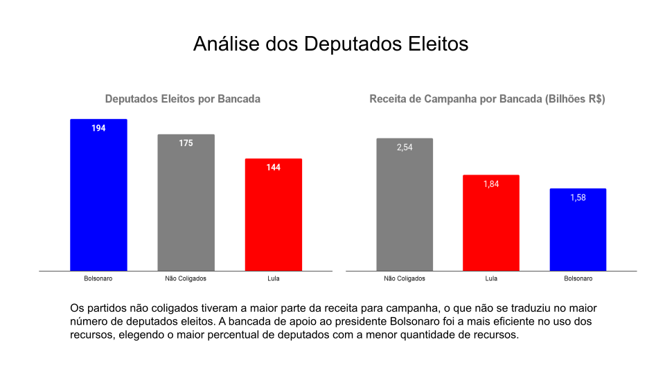

<h1>Análise dos Deputados Eleitos em 2022</h1>

Passada as eleições de primeiro turno que definiram a composição da câmara, tem-se a oportunidade de verificar padrões das candidaturas 
eleitas e característica da representatividade dos deputados eleitos.

Esta análise se utilizou dos dados das candidaturas coletados e abertos pelo TSE e compilados pela plataforma basedosdados.org, que disponibiliza 
os dados para consulta através de banco de dados disponíveis para a consulta através do Google Big Query. Para filtrar os candidatos eleitos foi feito 
um scrapping dos dados das candidaturas eleitas do portal UOL. Este processo foi feito com uso de Python e os dados obtidos foram armazenados em um banco
de dados no Google Big Query.

<a href="https://docs.google.com/presentation/d/e/2PACX-1vR7apt7_F4vfVK4LmgxBWR1Lgz1DglLnK4yFNkcl2iLlEPvFpCXc60L4tMrU86Wp6wge27Q3kBF1PIv/pub?start=false&loop=false&delayms=3000">Apresentação com insights</a>

<a href="https://deepnote.com/@study-1d93/Scrap-Candidatos-Eleitos-40e553a8-385c-41d9-81e6-7f2054338b1c">Link para o notebook do projeto completo</a>

